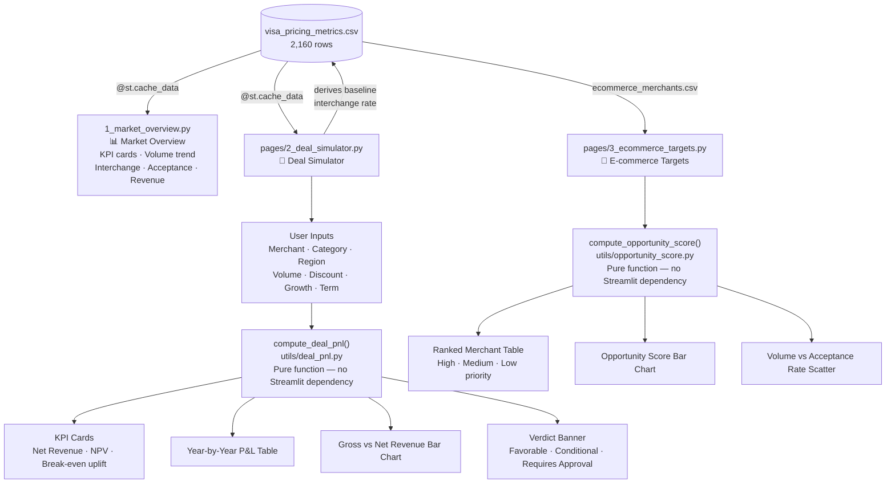
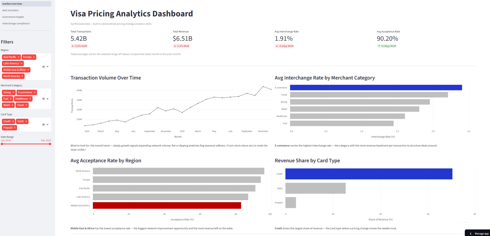
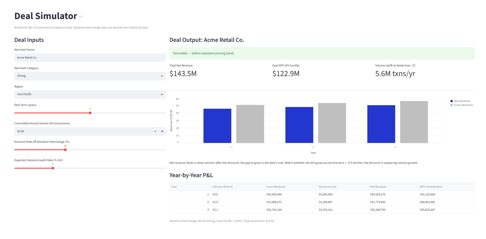

# Visa Pricing Analyst

This project models the pricing strategy analytics work performed by Visa's Global Pricing Strategy team. It synthesises 2,160 rows of transaction data across 5 regions, 6 merchant categories, and 3 card types to surface interchange rate trends, merchant acceptance patterns, and deal P&L economics. The centrepiece is an interactive deal simulator that models the net revenue, NPV, and break-even volume of a merchant acceptance deal — the same kind of tool a Pricing Strategy Analyst uses to evaluate and structure client deals.

## Live Dashboard

**URL:** https://visa-pricing-analyst-k6dawusfsc9vetupcdqhnw.streamlit.app/

## Job Posting

- **Role:** Analyst, Pricing Strategy
- **Company:** Visa Inc.

This project directly demonstrates the role's core requirements: rigorous quantitative analysis, financial modeling, and the ability to synthesise large datasets into actionable pricing recommendations for business leaders.

## Tech Stack

| Layer | Tool |
|---|---|
| Data | Synthesized CSV — Python generator script |
| Data Processing | Pandas |
| Financial Model | Python pure function (`compute_deal_pnl`) |
| Visualisation | Altair |
| Dashboard | Streamlit (four-page multipage app) |
| Testing | pytest (8 unit tests) |
| Deployment | Streamlit Community Cloud |

## Pipeline Diagram



## Data Schema

The dataset (`streamlit_app/data/visa_pricing_metrics.csv`) has 2,160 rows — one per month/region/category/card-type combination.

| Column | Type | Description |
|---|---|---|
| `month` | date | Month of observation (Jan 2024 – Dec 2025) |
| `region` | string | One of 5 global regions |
| `merchant_category` | string | One of 6 merchant categories |
| `card_type` | string | Credit, Debit, or Prepaid |
| `transaction_volume` | integer | Number of transactions |
| `avg_transaction_usd` | float | Average transaction value in USD |
| `interchange_rate` | float | Interchange rate as a decimal (e.g. 0.0195) |
| `revenue_usd` | float | Revenue = volume × avg_txn × interchange_rate |
| `acceptance_rate` | float | Share of attempted transactions approved |

## Dashboard Preview

### Market Overview


### Deal Simulator


### Interchange Compliance Monitor
Audits assessed interchange against the published rate schedule, flags deviations beyond a configurable tolerance, and quantifies the financial impact (over- vs under-assessment) — with a management-review queue. Tailored to Visa's Global Interchange Strategy / Compliance work.

## Key Insights

**Descriptive (what does the data show?):** E-commerce and Travel carry the highest interchange rates at 2.4% and 2.2% respectively, while Fuel sits at 1.45% — a 66% spread across categories that represents significant revenue variation per transaction.

**Diagnostic (why does the gap exist?):** North America leads merchant acceptance at 96% while Middle East & Africa sits at 83%, a 13-point gap that persists across all merchant categories — pointing to network maturity and infrastructure differences rather than category-specific friction.

**Recommendation:** Target E-commerce deal negotiations with volume-for-discount structures first — the combination of high interchange headroom (2.4%) and strong digital growth trajectory means larger deals can absorb meaningful discounts while remaining NPV-positive. Use the Deal Simulator to model the exact break-even volume before committing to a discount tier.

- **Who to target:** The E-commerce Merchant Targets page scores and ranks the full pipeline. Top-tier deals: **NovaMart** (North America, 180M txns/yr) on volume, **Apex Digital** (Europe, 18% YoY growth) on growth trajectory, and **TechDirect** (Asia Pacific, 22% growth, 89% acceptance) on the combination of growth and network gap. Middle East & Africa merchants carry the lowest acceptance rates (82–84%) but insufficient volume to score in the top tier — pointing to an infrastructure investment case rather than a discount deal.

- **Deal structure:** Lead with a 10–15% discount off the 2.4% standard rate in exchange for a minimum annual volume commitment. At 10% discount, a 50M transaction/year merchant needs only 5.6M additional transactions to break even — a realistic uplift ask for a growing e-commerce player. Avoid discounts above 20% without a 3–5 year term to ensure NPV recovery.

- **Risks:** E-commerce interchange premiums depend on fraud rates staying controlled — any deterioration in authorization rates erodes the margin that makes the discount viable. Deal terms should include acceptance rate floor clauses. Volume commitments should be measured on net approved transactions, not gross attempts.

## Setup & Reproduction

**Requirements:** Python 3.10+

```bash
# Install dependencies
pip install streamlit altair pandas pytest

# Run the dashboard (from streamlit_app/)
cd streamlit_app
streamlit run 1_market_overview.py

# Run tests (from project root)
pytest
```

To regenerate the dataset from scratch:

```bash
cd streamlit_app
python generate_data.py
```

## Repository Structure

    .
    ├── streamlit_app/
    │   ├── 1_market_overview.py     # Page 1: Market Overview dashboard
    │   ├── pages/
    │   │   ├── 2_deal_simulator.py       # Page 2: Deal Simulator
    │   │   ├── 3_ecommerce_targets.py    # Page 3: E-commerce Merchant Targets
    │   │   └── 4_interchange_compliance.py  # Page 4: Interchange Compliance Monitor
    │   ├── utils/
    │   │   ├── data_loader.py            # Shared cached CSV loader
    │   │   ├── deal_pnl.py               # Core financial model (pure function)
    │   │   ├── opportunity_score.py      # Merchant opportunity scoring (pure function)
    │   │   └── compliance.py             # Interchange compliance audit (pure function)
    │   ├── data/
    │   │   ├── visa_pricing_metrics.csv
    │   │   └── ecommerce_merchants.csv
    │   └── generate_data.py         # Synthetic data generator
    ├── tests/
    │   ├── test_deal_pnl.py              # 8 unit tests for the financial model
    │   ├── test_opportunity_score.py     # 7 unit tests for the opportunity score function
    │   └── test_compliance.py            # 8 unit tests for the compliance audit function
    ├── docs/
    │   ├── proposal.md              # Project proposal
    │   └── pipeline-diagram.md      # Data flow diagram
    ├── pytest.ini                   # Test configuration
    └── README.md
