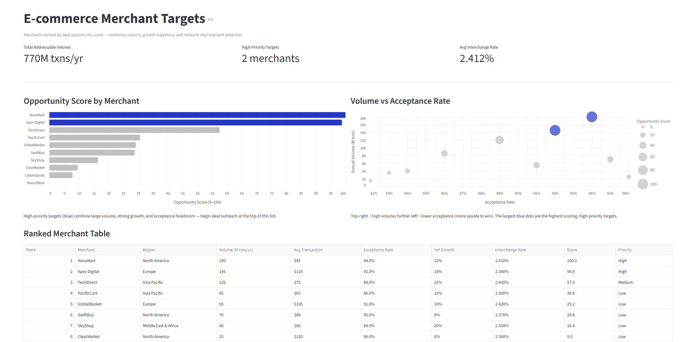
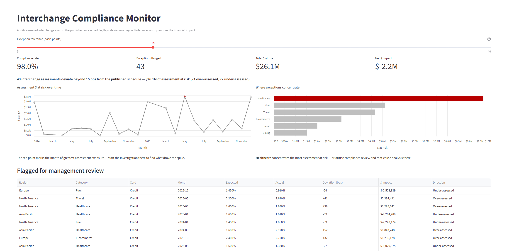
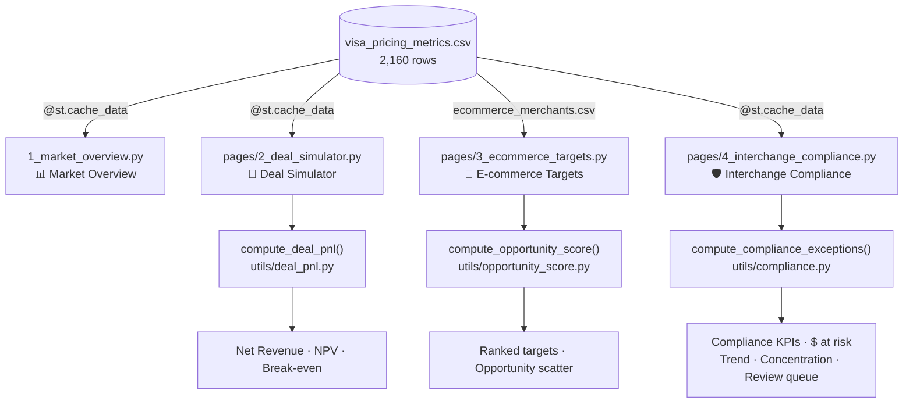

# Visa Pricing Analyst

### [Live Dashboard →](https://visa-pricing-analyst-k6dawusfsc9vetupcdqhnw.streamlit.app/)





**A four-page pricing-strategy dashboard: market analytics, an interactive deal P&L simulator, a ranked merchant-targeting engine, and an interchange-compliance monitor that flags mis-assessments and their financial impact.**

---

This project models the pricing strategy and interchange compliance work performed by Visa's Global Pricing Strategy team. It synthesises 2,160 rows of transaction data across 5 regions, 6 merchant categories, and 3 card types to surface interchange rate trends, merchant acceptance patterns, and deal P&L economics. The **deal simulator** models the net revenue, NPV, and break-even volume of a merchant acceptance deal; the **targeting engine** ranks merchants by an opportunity score; and the **compliance monitor** audits assessed interchange against the published rate schedule and quantifies the financial impact of any deviation — the same kinds of tools a Pricing Strategy / Interchange Compliance Analyst uses day to day. Every chart follows *Storytelling with Data* principles (muted palette with a single purposeful accent, decluttered axes, and an insight line stating the takeaway).

## Key Insights

**Descriptive (what does the data show?):** E-commerce and Travel carry the highest interchange rates at 2.4% and 2.2% respectively, while Fuel sits at 1.45% — a 66% spread across categories that represents significant revenue variation per transaction.

**Diagnostic (why does the gap exist?):** North America leads merchant acceptance at 96% while Middle East & Africa sits at 83%, a 13-point gap that persists across all merchant categories — pointing to network maturity and infrastructure differences rather than category-specific friction.

**Recommendation:** Target E-commerce deal negotiations with volume-for-discount structures first — the combination of high interchange headroom (2.4%) and strong digital growth means larger deals can absorb meaningful discounts while remaining NPV-positive. Use the Deal Simulator to model the exact break-even volume before committing to a discount tier.

- **Who to target:** The E-commerce Merchant Targets page scores and ranks the full pipeline. Top-tier deals: **NovaMart** (North America, 180M txns/yr) on volume, **Apex Digital** (Europe, 18% YoY growth) on growth trajectory, and **TechDirect** (Asia Pacific, 22% growth, 89% acceptance) on the combination of growth and network gap.

- **Deal structure:** Lead with a 10–15% discount off the 2.4% standard rate in exchange for a minimum annual volume commitment. At 10% discount, a 50M transaction/year merchant needs only ~5.6M additional transactions to break even. Avoid discounts above 20% without a 3–5 year term to ensure NPV recovery.

- **Compliance:** At a 15 bps tolerance the monitor flags 43 mis-assessed segments — $26.1M of interchange at risk (net −$2.2M under-assessed), concentrated in Healthcare. The review queue surfaces the largest-dollar exceptions first so the highest-impact discrepancies are investigated before they compound.

## Tech Stack

| Layer | Tool |
|---|---|
| Data | Synthesized CSV — Python generator script |
| Data Processing | Pandas / NumPy |
| Pure functions | `compute_deal_pnl`, `compute_opportunity_score`, `compute_compliance_exceptions` (no Streamlit dependency) |
| Visualisation | Altair (Storytelling-with-Data styling via `utils/chart_style.py`) |
| Dashboard | Streamlit (four-page multipage app) |
| Testing | pytest (23 unit tests) |
| Deployment | Streamlit Community Cloud |

## Data Schema

The dataset (`streamlit_app/data/visa_pricing_metrics.csv`) has 2,160 rows — one per month/region/category/card-type combination.

| Column | Type | Description |
|---|---|---|
| `month` | date | Month of observation (Jan 2024 – Dec 2025) |
| `region` | string | One of 5 global regions |
| `merchant_category` | string | One of 6 merchant categories |
| `card_type` | string | Credit, Debit, or Prepaid |
| `transaction_volume` | integer | Number of transactions |
| `avg_transaction_usd` | float | Average transaction value in USD |
| `interchange_rate` | float | Interchange rate as a decimal (e.g. 0.0195) |
| `revenue_usd` | float | Revenue = volume × avg_txn × interchange_rate |
| `acceptance_rate` | float | Share of attempted transactions approved |

## Pipeline Diagram



## Setup & Reproduction

**Requirements:** Python 3.10+

```bash
# Install dependencies
pip install streamlit altair pandas pytest

# Run the dashboard (from streamlit_app/)
cd streamlit_app
streamlit run 1_market_overview.py

# Run tests (from project root)
pytest
```

To regenerate the dataset from scratch (includes the injected compliance anomalies):

```bash
cd streamlit_app
python generate_data.py
```

## Repository Structure

    .
    ├── streamlit_app/
    │   ├── 1_market_overview.py     # Page 1: Market Overview dashboard
    │   ├── pages/
    │   │   ├── 2_deal_simulator.py          # Page 2: Deal Simulator
    │   │   ├── 3_ecommerce_targets.py       # Page 3: E-commerce Merchant Targets
    │   │   └── 4_interchange_compliance.py  # Page 4: Interchange Compliance Monitor
    │   ├── utils/
    │   │   ├── data_loader.py            # Shared cached CSV loader
    │   │   ├── chart_style.py            # Shared Storytelling-with-Data chart styling
    │   │   ├── deal_pnl.py               # Deal P&L model (pure function)
    │   │   ├── opportunity_score.py      # Merchant opportunity scoring (pure function)
    │   │   └── compliance.py             # Interchange compliance audit (pure function)
    │   ├── data/
    │   │   ├── visa_pricing_metrics.csv
    │   │   └── ecommerce_merchants.csv
    │   └── generate_data.py         # Synthetic data generator
    ├── tests/
    │   ├── test_deal_pnl.py              # unit tests for the financial model
    │   ├── test_opportunity_score.py     # unit tests for the opportunity score function
    │   └── test_compliance.py            # unit tests for the compliance audit function
    ├── docs/
    ├── pytest.ini                   # Test configuration
    └── README.md
